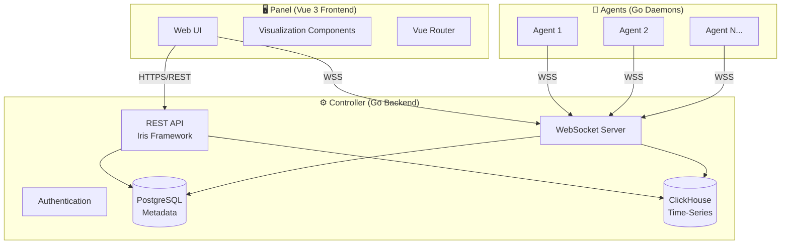
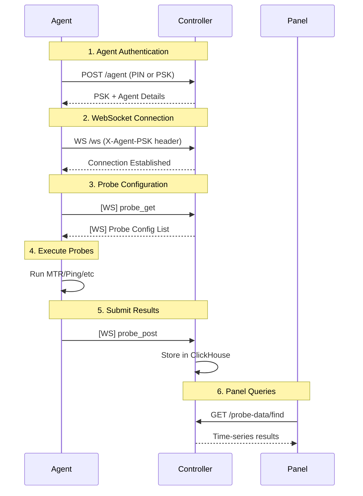
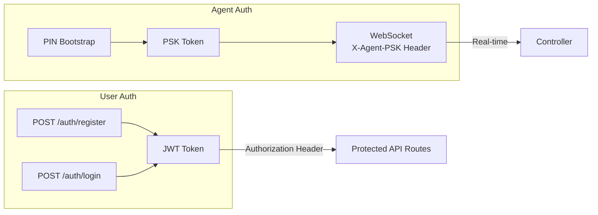

# NetWatcher Architecture Overview

## System Components

NetWatcher is a distributed network monitoring system composed of three main components:



---

## Component Details

### 1. Panel (Frontend)

| Attribute | Details |
|-----------|---------|
| **Framework** | Vue 3 + TypeScript |
| **Build Tool** | Vite |
| **Router** | Vue Router 4 |
| **Location** | `/panel/` |

**Key Directories:**
- `src/views/` – Page components organized by feature
- `src/components/` – Reusable UI components (charts, cards, navigation)
- `src/services/` – API client abstractions
- `src/types.ts` – TypeScript interfaces matching backend models

**Notable Features:**
- Real-time data visualization via WebSocket
- Network topology mapping (`NetworkMap.vue`)
- Multi-probe charting (`PingGraph.vue`, `TrafficSimGraph.vue`)

---

### 2. Controller (Backend)

| Attribute | Details |
|-----------|---------|
| **Language** | Go 1.21+ |
| **Framework** | [Iris](https://github.com/kataras/iris) |
| **Databases** | PostgreSQL (GORM) + ClickHouse |
| **Location** | `/controller/` |

**Key Packages:**
```
controller/
├── main.go              # Entrypoint, DB init, route setup
├── internal/
│   ├── admin/           # Site admin bootstrap, system stats
│   ├── agent/           # Agent CRUD, auth, PSK management
│   ├── alert/           # Alert rules and incident management
│   ├── database/        # Database connection helpers
│   ├── email/           # Email queue, SMTP client, background worker
│   ├── errors/          # Structured error types
│   ├── geoip/           # MaxMind GeoIP2 database lookups
│   ├── limits/          # Workspace resource limit enforcement
│   ├── lookup/          # IP lookup helpers
│   ├── oui/             # IEEE OUI (MAC vendor) database
│   ├── probe/           # Probe CRUD, ClickHouse handlers
│   ├── scheduler/       # Data retention and cleanup scheduler
│   ├── share/           # Sharable agent/probe page tokens
│   ├── speedtest/       # Speedtest Queue & Server Cache
│   ├── users/           # User registration, JWT auth
│   ├── whois/           # WHOIS lookups via system command
│   └── workspace/       # Workspace + member management
└── web/
    ├── router.go        # Route registration
    ├── admin.go         # Site admin API endpoints
    ├── admin_middleware.go # Admin role enforcement
    ├── alerts.go        # Alert CRUD endpoints
    ├── auth.go          # User auth endpoints
    ├── agent.go         # Agent login endpoint
    ├── agent_api.go     # Agent-facing API (whoami, lookup)
    ├── agent_hub.go     # Agent WebSocket connection hub
    ├── agents.go        # Agent CRUD endpoints
    ├── broadcast.go     # Real-time broadcast helpers
    ├── data.go          # Probe data query endpoints
    ├── geoip.go         # GeoIP & WHOIS endpoints
    ├── helpers.go       # Shared handler helpers
    ├── invite.go        # Workspace invitation endpoints
    ├── middleware.go    # Request middleware
    ├── oui.go           # OUI/MAC vendor lookup endpoints
    ├── permissions.go   # Permission enforcement helpers
    ├── probes.go        # Probe CRUD endpoints
    ├── proxy.go         # Proxy endpoints
    ├── share.go         # Sharable page endpoints
    ├── speedtest.go     # Speedtest queue endpoints
    ├── workspaces.go    # Workspace CRUD endpoints
    ├── ws.go            # WebSocket server (agents)
    ├── ws_raw_panel.go  # WebSocket server (panel clients)
    └── ws_raw_share.go  # WebSocket server (shared pages)
```

---

### 3. Agent (Daemon)

| Attribute | Details |
|-----------|---------|
| **Language** | Go |
| **Protocol** | WebSocket (gobwas) |
| **Probes** | MTR, Ping, Speedtest, SysInfo, NetInfo, TrafficSim |
| **Location** | `/agent/` |

**Key Files:**
```
agent/
├── main.go                    # Entrypoint, WS connection
├── env.go                     # Environment variable loading
├── auto_updater.go            # Agent self-update with SHA256 verification
├── dependency_download.go     # External binary downloads (trippy, etc.)
├── probes/
│   ├── types.go               # Probe/ProbeData structures
│   ├── mtr.go                 # MTR probe (uses Trippy)
│   ├── ping.go                # ICMP ping probe
│   ├── speedtest.go           # Speed test
│   ├── speedtest_queue.go     # Speedtest job queue
│   ├── sysinfo.go             # System information
│   ├── netinfo.go             # Network information
│   ├── trafficsim.go          # TrafficSim UDP client/server
│   ├── interfaces.go          # Network interface discovery
│   ├── interfaces_unix.go     # Unix-specific interface helpers
│   ├── interfaces_windows.go  # Windows-specific interface helpers
│   └── utils.go               # Probe utility functions
├── workers/
│   ├── probes.go              # Probe polling & execution worker
│   ├── data.go                # Data submission worker
│   └── retry_queue.go         # Failed submission retry queue
└── web/                       # WS client + config
```

---

## Data Flow



---

## Database Schema

### PostgreSQL (Metadata)

| Table | Purpose |
|-------|---------|
| `users` | User accounts + hashed passwords |
| `workspaces` | Workspace containers |
| `workspace_members` | User-workspace membership |
| `agents` | Agent registration + PSK hashes |
| `probes` | Probe configurations |
| `probe_targets` | Probe targets (host or agent reference) |

### ClickHouse (Time-Series)

| Table | Purpose |
|-------|---------|
| `probe_data` | All probe results (partitioned by date) |

---

## Probe Types

| Type | Description |
|------|-------------|
| `MTR` | Multi-hop traceroute with latency/loss per hop |
| `PING` | ICMP ping with RTT statistics |
| `SPEEDTEST` | Download/upload speed tests |
| `SYSINFO` | System info (CPU, memory, host details) |
| `NETINFO` | Network info (public IP, gateway, ISP) |
| `TRAFFICSIM` | Inter-agent traffic simulation |
| `AGENT` | Agent-to-agent targeting (meta-type) |

---

## Authentication Flow



**Agent Authentication Methods:**
1. **PIN Bootstrap** – One-time PIN issued from panel, agent exchanges for PSK
2. **PSK Auth** – Persistent pre-shared key for subsequent connections

---

## Environment Variables

See [.env.example](../.env.example) for a complete annotated reference.

### Controller – Core

| Variable | Description |
|----------|-------------|
| `DEBUG` | Enable debug mode (default: `false`) |
| `LISTEN` | HTTP listen address (default: `0.0.0.0:8080`) |
| `JWT_SECRET` | JWT signing key |
| `PIN_PEPPER` | Salt for PIN hashing |
| `REGISTRATION_ENABLED` | Allow new user registration (default: `true`) |

### Controller – PostgreSQL

| Variable | Description |
|----------|-------------|
| `DB_DRIVER` | Database driver: `postgres`, `mysql`, `sqlite`, `sqlserver` |
| `POSTGRES_HOST` | PostgreSQL host |
| `POSTGRES_PORT` | PostgreSQL port |
| `POSTGRES_USER` | PostgreSQL user |
| `POSTGRES_PASSWORD` | PostgreSQL password |
| `POSTGRES_DB` | PostgreSQL database name |
| `POSTGRES_SSLMODE` | SSL mode (default: `disable`) |
| `POSTGRES_TIMEZONE` | Timezone (default: `America/Vancouver`) |
| `GORM_LOG` | GORM log level: `silent`, `error`, `warn`, `info` |
| `DB_MAX_OPEN_CONNS` | Max open connections (default: `25`) |
| `DB_MAX_IDLE_CONNS` | Max idle connections (default: `25`) |
| `DB_CONN_MAX_LIFETIME` | Connection max lifetime (default: `30m`) |
| `DB_CONN_MAX_IDLE_TIME` | Connection max idle time (default: `10m`) |

### Controller – ClickHouse

| Variable | Description |
|----------|-------------|
| `CLICKHOUSE_HOST` | ClickHouse host |
| `CLICKHOUSE_PORT` | ClickHouse native port (default: `9000`) |
| `CLICKHOUSE_USER` | ClickHouse user |
| `CLICKHOUSE_PASSWORD` | ClickHouse password |
| `CLICKHOUSE_DB` | ClickHouse database (default: `default`) |

### Controller – Email / SMTP

| Variable | Description |
|----------|-------------|
| `SMTP_HOST` | SMTP server host |
| `SMTP_PORT` | SMTP port (default: `587`) |
| `SMTP_USER` | SMTP username |
| `SMTP_PASSWORD` | SMTP password |
| `SMTP_FROM_EMAIL` | Sender address |
| `SMTP_FROM_NAME` | Sender display name |
| `SMTP_TLS` | Use TLS (default: `true`) |
| `SMTP_SKIP_VERIFY` | Skip TLS certificate verification |
| `EMAIL_WEBHOOK_URL` | Webhook URL (alternative to SMTP, takes precedence) |
| `EMAIL_WEBHOOK_AUTH_TOKEN` | Webhook auth token |
| `EMAIL_WEBHOOK_TIMEOUT` | Webhook timeout (default: `30s`) |

### Controller – Email Features

| Variable | Description |
|----------|-------------|
| `EMAIL_SEND_REGISTRATION_CONFIRMATION` | Send welcome email on registration |
| `REQUIRE_EMAIL_VERIFICATION` | Require verified email for workspace creation |
| `EMAIL_VERIFICATION_EXPIRY_HOURS` | Verification token expiry (default: `24`) |
| `EMAIL_INVITE_EXPIRY_HOURS` | Invite token expiry (default: `168`) |
| `EMAIL_PASSWORD_RESET_EXPIRY_HOURS` | Password reset token expiry (default: `1`) |
| `PANEL_ENDPOINT` | Panel URL for links in emails |

### Controller – GeoIP

| Variable | Description |
|----------|-------------|
| `GEOIP_CITY_PATH` | Path to GeoLite2-City.mmdb |
| `GEOIP_COUNTRY_PATH` | Path to GeoLite2-Country.mmdb |
| `GEOIP_ASN_PATH` | Path to GeoLite2-ASN.mmdb |

### Controller – Data Retention

| Variable | Description |
|----------|-------------|
| `DATA_RETENTION_DAYS` | Days to keep probe data in ClickHouse (default: `90`) |
| `SOFT_DELETE_GRACE_DAYS` | Days before hard-deleting soft-deleted entities (default: `30`) |
| `CLEANUP_INTERVAL_HOURS` | Hours between cleanup runs (default: `24`) |

### Controller – Workspace Limits

| Variable | Description |
|----------|-------------|
| `MAX_MEMBERS_PER_WORKSPACE` | Max members per workspace (`0` = unlimited) |
| `MAX_AGENTS_PER_WORKSPACE` | Max agents per workspace (`0` = unlimited) |
| `MAX_PROBES_PER_AGENT` | Max probes per agent (`0` = unlimited) |
| `MAX_WORKSPACES_PER_USER` | Max workspaces per user (`0` = unlimited) |

### Agent

| Variable | Description |
|----------|-------------|
| `CONTROLLER_HOST` | Controller host:port (without protocol) |
| `CONTROLLER_SSL` | Use HTTPS/WSS instead of HTTP/WS (true/false) |
| `WORKSPACE_ID` | Target workspace ID |
| `AGENT_ID` | This agent's ID |
| `AGENT_PIN` or `AGENT_PSK` | Authentication credential |
