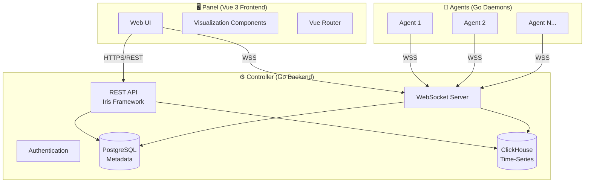
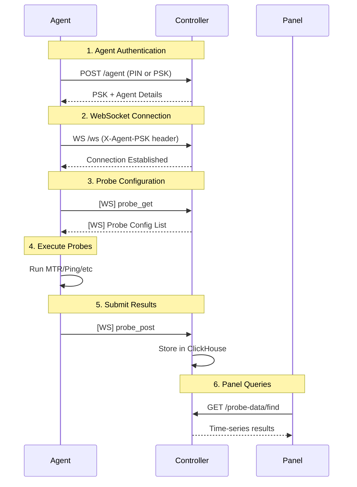
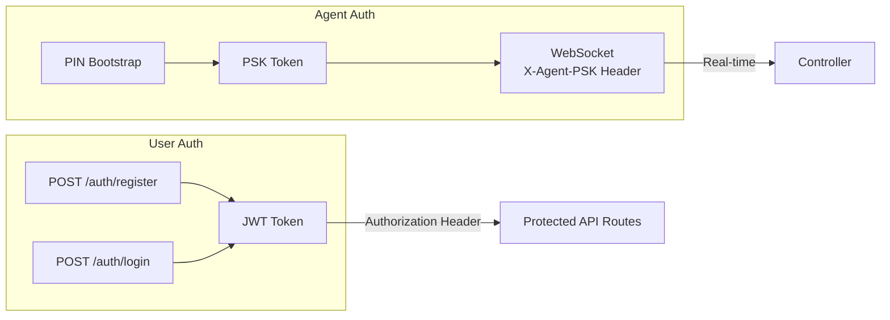

# NetWatcher Architecture Overview

## System Components

NetWatcher is a distributed network monitoring system composed of three main components:



---

## Component Details

### 1. Panel (Frontend)

| Attribute | Details |
|-----------|---------|
| **Framework** | Vue 3 + TypeScript |
| **Build Tool** | Vite |
| **Router** | Vue Router 4 |
| **Location** | `/panel/` |

**Key Directories:**
- `src/views/` – Page components organized by feature
- `src/components/` – Reusable UI components (charts, cards, navigation)
- `src/services/` – API client abstractions
- `src/types.ts` – TypeScript interfaces matching backend models

**Notable Features:**
- Real-time data visualization via WebSocket
- Network topology mapping (`NetworkMap.vue`)
- Multi-probe charting (`PingGraph.vue`, `TrafficSimGraph.vue`)

---

### 2. Controller (Backend)

| Attribute | Details |
|-----------|---------|
| **Language** | Go 1.21+ |
| **Framework** | [Iris](https://github.com/kataras/iris) |
| **Databases** | PostgreSQL (GORM) + ClickHouse |
| **Location** | `/controller/` |

**Key Packages:**
```
controller/
├── main.go              # Entrypoint, DB init, route setup
├── internal/
│   ├── agent/           # Agent CRUD, auth, PSK management
│   ├── database/        # Database connection helpers
│   ├── email/           # Email queue, SMTP client, background worker
│   ├── geoip/           # MaxMind GeoIP2 database lookups
│   ├── probe/           # Probe CRUD, ClickHouse handlers
│   ├── speedtest/       # Speedtest Queue & Server Cache
│   ├── users/           # User registration, JWT auth
│   ├── whois/           # WHOIS lookups via system command
│   └── workspace/       # Workspace + member management
└── web/
    ├── router.go        # Route registration
    ├── auth.go          # User auth endpoints
    ├── agent.go         # Agent login endpoint
    ├── agents.go        # Agent CRUD endpoints
    ├── geoip.go         # GeoIP & WHOIS endpoints
    ├── workspaces.go    # Workspace CRUD endpoints
    ├── probes.go        # Probe CRUD endpoints
    ├── data.go          # Probe data query endpoints
    └── ws.go            # WebSocket server
```

---

### 3. Agent (Daemon)

| Attribute | Details |
|-----------|---------|
| **Language** | Go |
| **Protocol** | WebSocket (gobwas) |
| **Probes** | MTR, Ping, Speedtest, SysInfo, NetInfo, TrafficSim |
| **Location** | `/agent/` |

**Key Files:**
```
agent/
├── main.go                    # Entrypoint, WS connection
├── probes/
│   ├── types.go               # Probe/ProbeData structures
│   ├── mtr.go                 # MTR probe (uses Trippy)
│   ├── ping.go                # ICMP ping probe
│   ├── speedtest.go           # Speed test
│   ├── sysinfo.go             # System information
│   └── netinfo.go             # Network information
├── workers/
│   ├── fetch_probes.go        # Probe polling worker
│   └── probe_data.go          # Data submission worker
└── web/                       # WS client + config
```

---

## Data Flow



---

## Database Schema

### PostgreSQL (Metadata)

| Table | Purpose |
|-------|---------|
| `users` | User accounts + hashed passwords |
| `workspaces` | Workspace containers |
| `workspace_members` | User-workspace membership |
| `agents` | Agent registration + PSK hashes |
| `probes` | Probe configurations |
| `probe_targets` | Probe targets (host or agent reference) |

### ClickHouse (Time-Series)

| Table | Purpose |
|-------|---------|
| `probe_data` | All probe results (partitioned by date) |

---

## Probe Types

| Type | Description |
|------|-------------|
| `MTR` | Multi-hop traceroute with latency/loss per hop |
| `PING` | ICMP ping with RTT statistics |
| `SPEEDTEST` | Download/upload speed tests |
| `SYSINFO` | System info (CPU, memory, host details) |
| `NETINFO` | Network info (public IP, gateway, ISP) |
| `TRAFFICSIM` | Inter-agent traffic simulation |
| `AGENT` | Agent-to-agent targeting (meta-type) |

---

## Authentication Flow



**Agent Authentication Methods:**
1. **PIN Bootstrap** – One-time PIN issued from panel, agent exchanges for PSK
2. **PSK Auth** – Persistent pre-shared key for subsequent connections

---

## Environment Variables

### Controller

| Variable | Description |
|----------|-------------|
| `LISTEN` | HTTP listen address (default: `0.0.0.0:8080`) |
| `POSTGRES_HOST` | PostgreSQL host |
| `POSTGRES_PORT` | PostgreSQL port |
| `POSTGRES_USER` | PostgreSQL user |
| `POSTGRES_PASSWORD` | PostgreSQL password |
| `POSTGRES_DB` | PostgreSQL database name |
| `CLICKHOUSE_HOST` | ClickHouse host |
| `CLICKHOUSE_USER` | ClickHouse user |
| `CLICKHOUSE_PASSWORD` | ClickHouse password |
| `JWT_SECRET` | JWT signing key |
| `PIN_PEPPER` | Salt for PIN hashing |
| `GEOIP_CITY_PATH` | Path to GeoLite2-City.mmdb |
| `GEOIP_COUNTRY_PATH` | Path to GeoLite2-Country.mmdb |
| `GEOIP_ASN_PATH` | Path to GeoLite2-ASN.mmdb |

### Agent

| Variable | Description |
|----------|-------------|
| `CONTROLLER_HOST` | Controller host:port (without protocol) |
| `CONTROLLER_SSL` | Use HTTPS/WSS instead of HTTP/WS (true/false) |
| `WORKSPACE_ID` | Target workspace ID |
| `AGENT_ID` | This agent's ID |
| `AGENT_PIN` or `AGENT_PSK` | Authentication credential |
