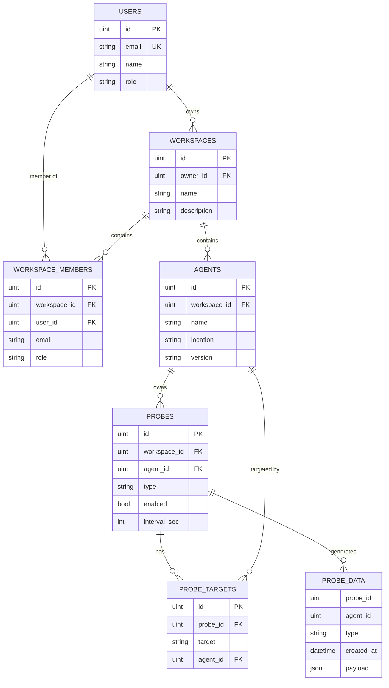

# NetWatcher Data Models

This document provides a comprehensive reference for all data models used across NetWatcher components.

---

## Core Entities

### User

Represents a user account in the system.

**PostgreSQL Table:** `users`

| Field | Type | Description |
|-------|------|-------------|
| `id` | uint | Primary key |
| `email` | string | Unique email address |
| `password_hash` | string | Bcrypt hashed password (not exposed via API) |
| `name` | string | Display name |
| `role` | string | Default: `"USER"` |
| `verified` | bool | Email verification status |
| `labels` | jsonb | Arbitrary key-value pairs |
| `metadata` | jsonb | Extended metadata |
| `last_login_at` | timestamp | Last successful login |
| `created_at` | timestamp | Record creation time |
| `updated_at` | timestamp | Last update time |

**TypeScript Interface:**
```typescript
interface User {
  id: number;
  email: string;
  name: string;
  role: string;
  verified: boolean;
  labels: Record<string, unknown>;
  metadata: Record<string, unknown>;
  lastLoginAt?: string | null;
  createdAt: string;
  updatedAt: string;
}
```

---

### Workspace

Container for agents, probes, and team members.

**PostgreSQL Table:** `workspaces`

| Field | Type | Description |
|-------|------|-------------|
| `id` | uint | Primary key |
| `name` | string | URL-safe identifier |
| `owner_id` | uint | FK to users |
| `description` | string | Display name/description |
| `settings` | jsonb | Workspace configuration |
| `created_at` | timestamp | |
| `updated_at` | timestamp | |
| `deleted_at` | timestamp | Soft delete marker |

**TypeScript Interface:**
```typescript
interface Workspace {
  id: number;
  name: string;
  ownerId: number;
  description: string;
  settings: Record<string, unknown>;
  createdAt: string;
  updatedAt: string;
}
```

---

### Member

Workspace membership with role-based access.

**PostgreSQL Table:** `workspace_members`

| Field | Type | Description |
|-------|------|-------------|
| `id` | uint | Primary key |
| `workspace_id` | uint | FK to workspaces |
| `user_id` | uint | FK to users (0 = email-only invite) |
| `email` | string | Invited user's email |
| `role` | string | `USER`, `ADMIN`, or `OWNER` |
| `meta` | jsonb | Additional metadata |
| `invited_at` | timestamp | Invitation timestamp |
| `accepted_at` | timestamp | Acceptance timestamp |
| `revoked_at` | timestamp | Revocation timestamp |
| `created_at` | timestamp | |
| `updated_at` | timestamp | |

**Role Hierarchy:**
```
OWNER > ADMIN > USER
```

**TypeScript Interface:**
```typescript
type Role = 'USER' | 'ADMIN' | 'OWNER';

interface Member {
  id: number;
  workspace_id: number;
  user_id: number;
  email: string;
  role: Role;
  meta: Record<string, unknown>;
  created_at: string;
  updated_at: string;
  invited_at?: string | null;
  accepted_at?: string | null;
  revoked_at?: string | null;
}
```

---

### Agent

Network monitoring agent deployed on remote hosts.

**PostgreSQL Table:** `agents`

| Field | Type | Description |
|-------|------|-------------|
| `id` | uint | Primary key |
| `workspace_id` | uint | FK to workspaces |
| `name` | string | Human-readable identifier |
| `description` | string | Optional description |
| `location` | string | Geographic location |
| `public_ip_override` | string | Manual IP override |
| `version` | string | Agent software version |
| `psk_hash` | string | Bcrypt hashed PSK (not exposed) |
| `initialized` | bool | Whether agent has connected |
| `last_seen_at` | timestamp | Last heartbeat/connection |
| `labels` | jsonb | Arbitrary key-value pairs |
| `metadata` | jsonb | Extended metadata |
| `created_at` | timestamp | |
| `updated_at` | timestamp | |

**TypeScript Interface:**
```typescript
interface Agent {
  id: number;
  created_at: string;
  updated_at: string;
  workspace_id: number;
  name: string;
  description: string;
  location: string;
  public_ip_override: string;
  version: string;
  last_seen_at: string;
  labels: Record<string, unknown>;
  metadata: Record<string, unknown>;
  initialized: boolean;
}
```

---

### Probe

Configuration for a monitoring check.

**PostgreSQL Table:** `probes`

| Field | Type | Description |
|-------|------|-------------|
| `id` | uint | Primary key |
| `workspace_id` | uint | FK to workspaces |
| `agent_id` | uint | FK to agents (probe owner) |
| `type` | varchar(64) | Probe type enum |
| `enabled` | bool | Active status |
| `interval_sec` | int | Execution interval |
| `timeout_sec` | int | Probe timeout |
| `count` | int | Samples per execution |
| `duration_sec` | int | Test duration |
| `server` | bool | Server mode flag (for TrafficSim) |
| `labels` | jsonb | Arbitrary key-value pairs |
| `metadata` | jsonb | Extended metadata |
| `created_at` | timestamp | |
| `updated_at` | timestamp | |
| `deleted_at` | timestamp | Soft delete marker |

**Probe Types:**
```go
const (
  TypeRPerf           = "RPERF"
  TypeMTR             = "MTR"
  TypePing            = "PING"
  TypeNetInfo         = "NETINFO"
  TypeSysInfo         = "SYSINFO"
  TypeSpeedtest       = "SPEEDTEST"
  TypeSpeedtestServer = "SPEEDTEST_SERVERS"
  TypeAgent           = "AGENT"
  TypeTrafficSim      = "TRAFFICSIM"
  TypeDNS             = "DNS"
  TypeWeb             = "WEB"
)
```

**TypeScript Interface:**
```typescript
type ProbeType = 
  | 'RPERF' 
  | 'MTR' 
  | 'PING' 
  | 'SPEEDTEST' 
  | 'SYSINFO' 
  | 'NETINFO' 
  | 'TRAFFICSIM'
  | 'AGENT'
  | 'DNS'
  | 'WEB';

interface Probe {
  id: number;
  created_at: string;
  updated_at: string;
  workspace_id: number;
  agent_id: number;
  type: ProbeType;
  enabled: boolean;
  interval_sec: number;
  timeout_sec: number;
  count: number;
  duration_sec: number;
  server: boolean;
  labels: Record<string, unknown>;
  metadata: Record<string, unknown>;
  targets: Target[];
}
```

---

### Target

Probe target configuration (host or agent reference).

**PostgreSQL Table:** `probe_targets`

| Field | Type | Description |
|-------|------|-------------|
| `id` | uint | Primary key |
| `probe_id` | uint | FK to probes |
| `target` | varchar(512) | Host/IP[:port] (empty if agent_id set) |
| `agent_id` | uint | FK to agents (inter-agent targeting) |
| `group_id` | uint | Optional grouping |
| `created_at` | timestamp | |
| `updated_at` | timestamp | |
| `deleted_at` | timestamp | |

**TypeScript Interface:**
```typescript
interface Target {
  id: number;
  created_at: string;
  updated_at: string;
  probe_id: number;
  target: string;
  agent_id?: number | null;
  group_id?: number | null;
}
```

---

## Time-Series Data (ClickHouse)

### ProbeData

Results from probe executions, stored in ClickHouse for efficient time-series queries.

**ClickHouse Table:** `probe_data`

| Column | Type | Description |
|--------|------|-------------|
| `probe_id` | UInt64 | FK reference to probes |
| `probe_agent_id` | UInt64 | Probe owner agent ID |
| `agent_id` | UInt64 | Reporting agent ID |
| `type` | String | Probe type |
| `triggered` | UInt8 | Boolean flag |
| `triggered_reason` | String | Trigger description |
| `target` | String | Target host/IP |
| `target_agent` | UInt64 | Target agent ID |
| `created_at` | DateTime64(3) | Agent timestamp |
| `received_at` | DateTime64(3) | Controller timestamp |
| `payload` | String | JSON payload |

**TypeScript Interface:**
```typescript
interface ProbeData {
  id: number;
  probe_id: number;
  probe_agent_id: number;
  agent_id: number;
  triggered: boolean;
  triggered_reason: string;
  created_at: string;
  received_at: string;
  type: string;
  payload: unknown;
  target?: string;
  targetAgent?: number;
}
```

---

## Probe Payloads

### PingPayload

```typescript
interface PingResult {
  start_timestamp: Date;
  stop_timestamp: Date;
  packets_recv: number;
  packets_sent: number;
  packets_recv_duplicates: number;
  packet_loss: number;
  addr: string;
  min_rtt: number;
  max_rtt: number;
  avg_rtt: number;
  std_dev_rtt: number;
}
```

---

### MTR Payload

```typescript
interface MtrResult {
  start_timestamp: Date;
  stop_timestamp: Date;
  report: {
    info: {
      target: {
        ip: string;
        hostname: string;
      };
    };
    hops: MtrHop[];
  };
}

interface MtrHop {
  ttl: number;
  hosts: { ip: string; hostname: string }[];
  extensions: string[];
  loss_pct: string;
  sent: number;
  last: string;
  recv: number;
  avg: string;
  best: string;
  worst: string;
  stddev: string;
}
```

---

### SpeedTest Payload

```typescript
interface SpeedTestResult {
  test_data: SpeedTestServer[];
  timestamp: Date;
}

interface SpeedTestServer {
  url?: string;
  lat?: string;
  lon?: string;
  name?: string;
  country?: string;
  sponsor?: string;
  id?: string;
  host?: string;
  distance?: number;
  latency?: number;
  max_latency?: number;
  min_latency?: number;
  jitter?: number;
  dl_speed?: number;
  ul_speed?: number;
  test_duration?: {
    ping?: number;
    download?: number;
    upload?: number;
    total?: number;
  };
  packet_loss?: {
    sent: number;
    dup: number;
    max: number;
  };
}
```

---

### NetInfo Payload

```typescript
interface NetInfoPayload {
  local_address: string;
  default_gateway: string;
  public_address: string;
  internet_provider: string;
  lat: string;
  long: string;
  timestamp: string;
}
```

---

### SysInfo Payload

```typescript
interface SysInfoPayload {
  hostInfo: HostInfo;
  memoryInfo: HostMemoryInfo;
  CPUTimes: CPUTimes;
  timestamp: Date;
}

interface HostInfo {
  architecture: string;
  boot_time: Date;
  containerized?: boolean | null;
  name: string;
  ip?: string[];
  kernel_version: string;
  mac: string[];
  os: OSInfo;
  timezone: string;
  timezone_offset_sec: number;
  uniqueID?: string;
}

interface OSInfo {
  type: string;
  family: string;
  platform: string;
  name: string;
  version: string;
  major: number;
  minor: number;
  patch: number;
  build?: string;
  codename?: string;
}

interface HostMemoryInfo {
  total_bytes: number;
  used_bytes: number;
  available_bytes: number;
  free_Bytes: number;
  virtual_total_bytes: number;
  virtual_used_bytes: number;
  virtual_free_bytes: number;
  raw?: Record<string, number>;
}

interface CPUTimes {
  user: number;
  system: number;
  idle?: number;
  iowait?: number;
  irq?: number;
  nice?: number;
  softIRQ?: number;
  steal?: number;
}
```

---

## Entity Relationships



---

## Index Recommendations

### PostgreSQL

```sql
-- Already created by GORM:
CREATE INDEX idx_agents_workspace_id ON agents(workspace_id);
CREATE INDEX idx_probes_agent_id ON probes(agent_id);
CREATE INDEX idx_probes_workspace_id ON probes(workspace_id);
CREATE INDEX idx_probe_targets_probe_id ON probe_targets(probe_id);
CREATE INDEX idx_probe_targets_agent_id ON probe_targets(agent_id);

-- Recommended additions:
CREATE INDEX idx_agents_last_seen ON agents(last_seen_at DESC);
CREATE INDEX idx_probes_type_agent ON probes(type, agent_id);
```

### ClickHouse

```sql
-- Create MergeTree with appropriate ordering
CREATE TABLE probe_data (
    probe_id UInt64,
    agent_id UInt64,
    type String,
    created_at DateTime64(3),
    received_at DateTime64(3),
    payload String
) ENGINE = MergeTree()
PARTITION BY toYYYYMM(created_at)
ORDER BY (agent_id, type, created_at);

-- Materialized views for common queries
CREATE MATERIALIZED VIEW mv_latest_by_agent
ENGINE = ReplacingMergeTree()
ORDER BY (agent_id, type)
POPULATE AS
SELECT 
    agent_id,
    type,
    argMax(payload, created_at) as latest_payload,
    max(created_at) as latest_at
FROM probe_data
GROUP BY agent_id, type;
```
