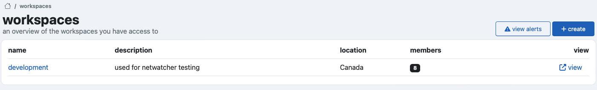
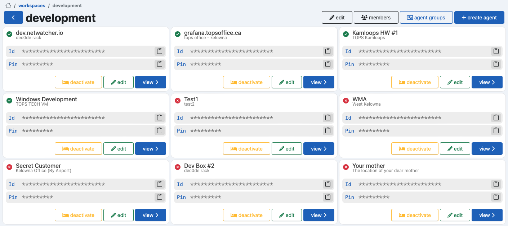
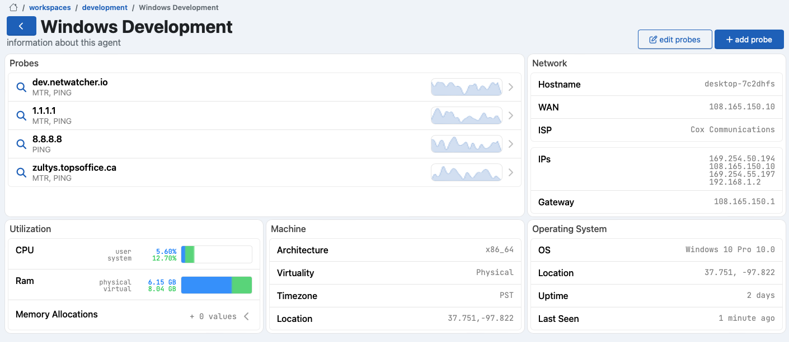
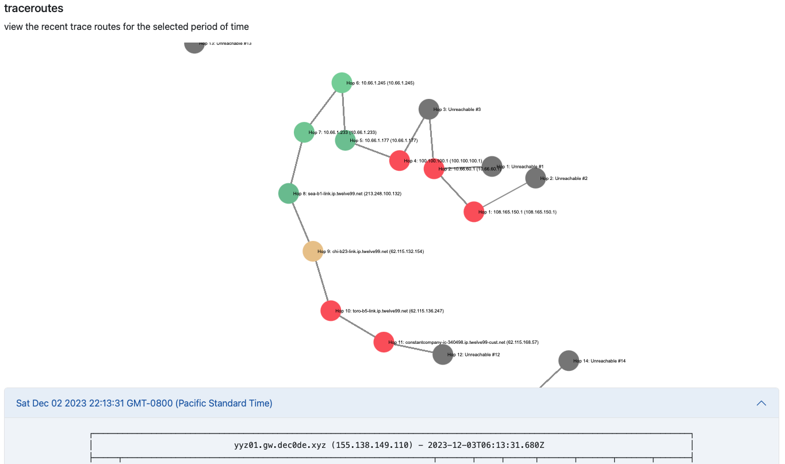
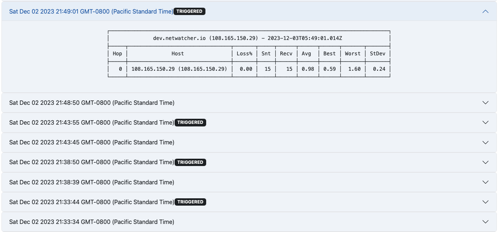

# Netwatcher Client

## Environment Variables

### Project-level environment variables

Variables that are used as defaults across all implementations of the service are decalred in the base `.env` file.

**.env**

```dotenv
NW_GLOBAL_ENDPOINT=https://api.netwatcher.io:8080
```

### Implementation-level environment variables

Variables intended to override global variables in `.env`, or variables related to the implementattion should be specific in a per-invocation `.env.local` file and should not be pushed to the repository.

**.env.local**

```dotenv
NW_ENDPOINT=https://api.myguardianinstance.org:8080
```

## Screenshots















## 


Project Setup

```sh
npm install
```

### Compile and Hot-Reload for Development

```sh
npm run dev
```

### Type-Check, Compile and Minify for Production

```sh
npm run build
```

### Run Unit Tests with [Vitest](https://vitest.dev/)

```sh
npm run test:unit
```
